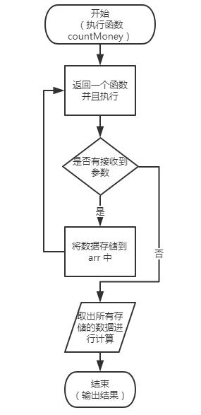

## js中的函数柯里化（Currying）

> 在计算机科学中，柯里化（Currying），又译为卡瑞化或加里化，是把接受多个参数的函数变换成接受一个单一参数（最初函数的第一个参数）的函数，并且返回接受余下的参数而且返回结果的新函数的技术。
> 
> -- [维基百科](https://en.wikipedia.org/wiki/Currying)
> 

### 从一道面试题谈谈函数柯里化

> 题目：使用js实现 add(1)(2)(3)(4) 返回10
> 

初次看到这个题目时，我想到的是闭包，因为闭包的定义是：定义在一个函数内部的函数，静态保存所有了父级作用域的内部函数。所以每次的值可以保存住，到了最后可以全部访问到。但是想到使用闭包，不知道如何去写，如果按题所示，不要求后续有无穷，所以可以多嵌套几层，但是当问题无限扩大时，就不是嵌套可以解决的了，于是我去百度搜索许多关于这方面的知识，今天进行一次总结。

通过函数柯里化的概念，我们可以对其进行处理。
当然下面是初始处理，并不是真正的柯里化。为了方便理解，逐步深入。

```js
//首先我们需要一个入口函数进行基本处理
var add=function(a){
	//定义一个保存所有传入的参数的数组，如果结果是为了求和，则
    var result=[];
    // 将第一个传入的参数放置进去
    result.push(a);
    // 定义函数 _add 引用result变量，使其保持不被销毁掉
    var _add=function(b){
        // 将参数push进入result中去
    	result.push(b);
        // 返回函数 _add 进行下次一调用
        return _add;
    }
    // 将原生自带的toString 进行重写
    _add.toString=function(){
    	console.log(result);
        return result;
    }
    // 返回 _add 函数进行下次调用
    return _add;
}
```
执行结果

```js
>>> add(1)
>>> [1]
>>> ƒ #<Function>

>>> add(1)(2)(3)
>>> (3) [1, 2, 3]
>>> ƒ #<Function>


>>> let a=add(1)(2)(3)
>>> a
>>> (3) [1, 2, 3]

>>> 如果没有重写 toString 方法时
>>> add(1)
>>> ƒ (b) {
>>> 					result.push(b);
>>> 					return _add;
>>> 				}
    
```

上面函数经过测试，发现返回了result的数组，在这个例子中，最主要的就是 `_add` 函数的问题，如何在调用结束后返回最终的 `result` 值，经过搜索查询发现了两个特殊方法，是我们平时最常见的 `toString` 和 `valueOf` 两个函数，关于这两个函数的相关信息[链接在此](https://segmentfault.com/a/1190000011853909)，如果没有重写 `toString` 则会输入函数内容，而不是结果。

在不赋值进行调用时会在游览器控制台输出一个 `ƒ #<Function>` ，目前不知道是什么原因。有知道的麻烦联系我。当然我在其他博客看到的也有其他一些不知名的提示，可以和下面博客参考着来看 [地址](https://www.cnblogs.com/daisykoo/p/5569619.html)


### 真正的函数柯里化

> 柯里化是将接受多个参数转换为接受一个单一参数来看。

其实在上面的例子中，也可以将所有参数放置进入一个函数的参数中来进行处理，也算是柯里化，但是我们这个例子讲真正的js柯里化。

假设你有一个储钱罐 `countMoney` 函数，和一个记录本 `arr` 数组，当你每月有空钱时进行储存，每次在 `arr` 中记录一次，存入储钱罐中

```js
var arr=[];
var countMoney=function(arr){
    var sum=0;
	for(var i=0;i<arr.length;i++){
    	sum+=arr[i];
    }
    return sum;
}

arr.push(1);
arr.push(2);

countMoney(arr);

```
可以通过这种方式来进行存储，但是有本记录，是会被发现的，所以这个时候，我们想是否可以这样

```js
// 每次存储是调用一次，不需要再次记录下来
countMoney(1);
countMoney(2);

// 等到真正需要的时候我们可以直接计算出来这个总值
countMoney(); //3
```
于是问题解决的方式变为柯里化问题，需要将多个参数接受转换为接受单一参数的问题。

于是我们可以使用下面的方式进行处理

```js

var countMoney = (function() {
    let moneys = 0;
    let arr = [];

    var result = function() {
        // 判断是否还有参数，如果没有，则返回存储起来值的总和
        if(arguments.length == 0) {
            for(var i = 0; i < arr.length; i++) {
                money += arr[i];
            }
            return money;
        } else {
            // arguments 是个类数组来着，应该用展开符展开才能push进去
            // 通过arguments 处理可以传入多个参数值
            console.log(...arguments)
            arr.push(...arguments);
            return result;
        }
    }
    return result;
})();

countMoney(1)(2)(3)
countMoney()
6
```
上面的例子完全可以实现柯里化，并且进行扩展，现在可以安全的存放钱了。

实际上，在JavaScript的很多思想和设计模式中，闭包是个很常见的且很重要的东西，上面两个例子代码中，本质上就是利用了闭包。上面的 `countMoney` 函数是个立即执行的函数，返回一个新函数，而这个新函数实际上就是一个闭包，这个新函数把每次接收到的参数都存储起来，并且继续返回一个新函数，当发现某次调用时没有传入参数，那就意味着要进行数据统计，从而把之前存储的数据一次拿出来计算，最后返回计算结果。

当然第一个例子也可以写成第二个立即执行的这种形式，两种方式可以互换。



### 总结

所谓的函数柯里化，亦或是在开发中设计到的其他一些概念。例如闭包、单例模式、观察者模式等等都好，我们需要关注的点是在于掌握这些模式的设计思想，而不是去死记硬背，比如高大上的模式或者其他的，都是由普通js的技术来构成的，只是因为其设计思想而出现不同质的变化。