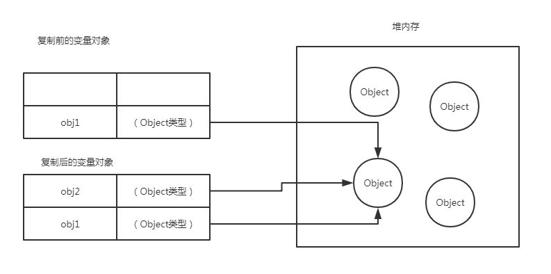

## 基本类型和引用类型的值

ECMAScript变量可能包含两种不同数据类型的值：基本类型值和引用类型值。
- 基本类型值指的是简单的数据段
按值访问，可操作保存在变量中的实际的值。基本类型值指的是简单的数据段。
基本数据类型有这五种：Undefined、Null、String、Number、Boolean。

```js
var str = "String";
```

- 引用类型指那些可能由多个值构成的对象
当复制保存着对象的某个变量时，操作的是对象的引用，但在为对象添加属性时，操作的是实际的对象。引用类型值指那些可能为多个值构成的对象。
引用类型值有这几种：object、Array、RegExp、Date、Function、特殊的基本包装类型(String、Number、Boolean)以及单体内置对象(Global、Math)。

```js
var person = new Object();
```

### 1. 动态属性

定义基本类型和引用类型值的方式是类似的：创建一个变量并为该变量赋值。但是，当这个值保存到变量中后，对不同类型值可以执行的操作则大相径庭。对于引用类型的值，我们可以为其添加属性和方法，也可以改变和删除其属性和方法。

- 基本类型值

```js
var nmae = "SpiritLing";
name.age = 22;
console.log(name.age);  //undefined
```

我们为字符串 `name` 定义了一个 `age` 的属性，并为该对象添加了一个名为 `age` 的属性。并为属性赋值，但在下一行访问时返回 `undefined` ，说明基本类型值无法动态的添加属性

- 引用类型值

```js
var person=new Object();
person.name = "SpiritLing";
console.log(person.name);  //"SpiritLing"
```

以上创建一个对象，并将其保存在变量 `person` 中。然后，我们为该对象添加一个属性 `name` ，并将其字符串赋值给这个属性。紧接着，又通过 `console.log()` 输出访问的结果，如果对象不被销毁，或者属性不被删除，则这个属性将一直存在。，说明引用类型值时可以动态添加属性

### 2. 复制变量值

基本类型和引用类型不至只有这个可以区分，还有好多，现在我们讲复制变量值两者的不同

- 基本类型值

```js
var num1=5;
var num2=num1;
num1=10;
console.log(num1);  //10
console.log(num2);  //5
```

定义 `num1` 时

|    |    |
| --- | --- |
|  num1  |  5  |

将 `num1` 赋值给 `num2` 后

|    |    |
| --- | --- |
|  num2  |  5  |
|  num1  |  5  |

改变 `num1` 值后

|    |    |
| --- | --- |
|  num2  |  5  |
|  num1  |  10  |

初始时， `num1` 中保存的值是5,。当使用 `num1` 的值来初始化 `num2` 时，`num2` 中也保存了值5,。但 `num2` 中的5与 `num1` 中的5是完全独立的，该值只是 `num1` 中5的副本。此后，这两个变量可以参与任何操作而不会影响。

- 引用类型 

```js
var obj1=new Object();
var obj2=obj1;
obj2.name="SpiritLing";
console.log(obj1.name);  //SpiritLing
console.log(obj2.name);  //SpiritLing
```



当从一个变量向另一个变量复制引用类型时，同样也会将存储在变量对象中的值复制一份放在为新变量分配的空间中。不同的是，这个值的副本实际上是一个指针，而这个指针指向存储在堆中的一个对象。复制操作结束后，两个变量将引用同一个对象。因此，改变其中一个变量时，就会影响另外一个。

首先，变量 `obj1` 保存了一个对象的新实例。然后，这个值被复制到 `obj2` 中；换句话说， `obj1` 和 `obj2` 都指向同一个对象。这样，当为 `obj2` 添加了 `name` 属性后，可以通过 `obj1` 来进行访问这个属性，因为这两个变量引用都指向同一个对象。上图展示了保存在对象中的变量和保存在堆中的对象之间的这种关系。

### 3. 传递参数

ECMAScript中所有`函数`的`参数`都是`按值传递`的。也就是说，把函数外部的值复制给函数内部的参数，就和把值从一个变量赋值到另一个变量一样。基本类型值的传递如同基本类型变量的复制一样，而引用类型值的传递，则如同引用类型变量的复制一样。

- 在这里有不少人会困惑，因为访问变量时，有按值和按引用两种方式，怎么参数只能按值传递呢？？

在向参数传递基本类型时，被传递的值会被复制给一个局部变量（即命名参数，或者用ECMAScript的概念来说，就是 `arguments` 对象的一个元素）。在向参数传递引用类型的值时，会把这个值在内存的地址复制给一个局部变量，因此这个局部变量的变化会反映在函数的外部。

```js
function addTen(num){
	num += 10;
    return num;
}
var count = 20;
var result=addTen(count);
console.log(count);  //20，没有变化
console.log(result);  //30
```

这里的函数 `addTen()` 有一个参数 `num` ，而参数实际上是函数的局部变量。在调用这个函数时，变量 `count` 作为参数被传递进去，这个变量的值是20。于是，数值20被复制给局部变量参数 `num` 以便在 `addTen()` 中使用。在函数中给 `num` 增加10，并不会改变原来的 `count` 的值，因为基本类型在变量复制时，不是引用其地址，而是在开辟一个空间，放入新复制的变量名和值，改变时，只会改变一个，而不会影响其他的变量。所以使用按值传递。

假设使用引用传递时，则改变 `num` 的值时，`count` 也会发生变化，从而反映函数内部的修改，当然，使用数值等基本类型值来说明按值传递参数比较简单，但如果使用对象，那么问题不太好理解了

```js
function setName(obj){
	obj.name = "SpiritLing";
}
var person = new Object();
setNmae(person);
console.log(person.name);  //"SpiritLing"
```

在上面的代码中，我们创建一个对象，并保存在变量 `person` 中，然后，这个变量被传递到 `setName()` 函数中之后就被复制给了 `obj` 。在函数的内部，`obj` 和 `person` 引用的是同一个对象。换句话说，即使这个变量时按值传递的，`obj` 也会按引用来访问同一个对象。于是，在函数内部添加属性，则在外面也会有所反应。因为 `person` 在堆内存中只有一个，而且是全局对象。

> 在这里，有许多人认为：在局部作用域中修改的对象会在全剧以作用域中反映出来，就说明参数是按引用传递的，但是，实际上是以值进行传递的。下面有个例子可以说明 

```js
function setName(obj){
	obj.name = "SpiritLing";
    obj = new Object();
    obj.name = "博客";
}
var person = new Object();
setName(person);
console.log(person.name);  //"SpiritLing"
```

上面代码和前面的代码有一些区别，就是在 `setName()` 函数中添加了两行代码：
* 一行为 `obj` 重新定义了一个对象
* 另一行为该对象定义了一个带有不同值的 `name` 属性

在把 `person` 传递给 `setName()` 后，其 `name` 属性被设置为 `"SpiritLing"` 。然后，又将一个新对象赋值给变量 `obj` ，同时将其 `name` 值改为 `"博客"` 。如果 `person` 使按照引用传递的，那么 `person` 会被自动修改为指向其 `name` 属性值为 `"博客"` 的新对象。但是，接下来再访问 `person.name` 时，显示的值仍然为 `"SpiritLing"` 。这说明即使在函数内部修改了参数的值，但原始的引用仍然保持不变。实际上，当在函数内部重写 `obj` 时，这个变量引用的就是一个局部对象。而这个局部对象会在函数执行完成后立即被销毁。

> 可以把 ECMAScript 函数的参数想象成局部变量。

### 4. 检测类型

在上面开始时，我们说了基本类型都有哪几种，引用类型又有哪几种，在其中，我们可以使用 `typeof` 对值进行类型判定，在对比种类即可确定属于那种类型。`typeof` 可以确认出字符串、数值、布尔值。还是 `undefined` ，如果变量的值是一个对象或者 `null` ，则 `typeof` 操作符会返回 `object`。

```js
var s = "SpiritLing";
var b = true;
var m = 123;
var u;
var n = null;
var o = new Object();

console.log(typeof s);  //string
console.log(typeof b);  //boolean
console.log(typeof m);  //number
console.log(typeof u);  //undefined
console.log(typeof n);  //object
console.log(typeof o);  //object
```

虽然上面可以使用 `typeof` 来监测，但是，实际上，`typeof` 更适合于监测基本类型，但在监检测引用类型的值时，这个操作符的用处不大。通常，我们并不是想知道某个值是对象，而是想知道它是什么类型的对象。为此，ECMAScript提供了 `instanceof` 操作符，其语法如下所示：

```js
result = variable instanceof constructor
```
如果变量是给定引用类型的实例，那么 `instanceof` 操作符就会返回 `true`

```js
var arr=[1,2,3,4];
var obj=new Object();
console.log(arr instanceof Array);  //true
console.log(obj instanceof Object);  //true
```

如果使用 `instanceof` 监测一个引用类型值和 `Object` 构建的函数时，`instanceof` 操作符始终会返回 `true`。当然，如果用来监测基本类型时，则始终返回 `false` ，因为基本类型不是对象。 